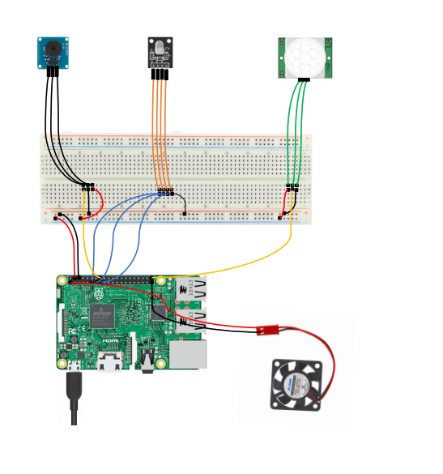

# uni-raspberry-motion
UTeM Wireless Project - Raspberry Pi GPIO Module Motion Detection with Alert System on Telegram Bot

WIRING GUIDE (RASPBERRY PI)

1. PIR MOTION SENSOR - GPIO 21
2. BUZZER            - GPIO 23
3. RGB LED MODULE    - 1. GPIO 17- RED
		    2. GPIO 22- BLUE
	            3. GPIO 27- GREEN
4. Power  - Pin 4(5V) (Red Wire)
5. Ground - Pin 6     (Black Wire)

The bot is probably Dead by now.

